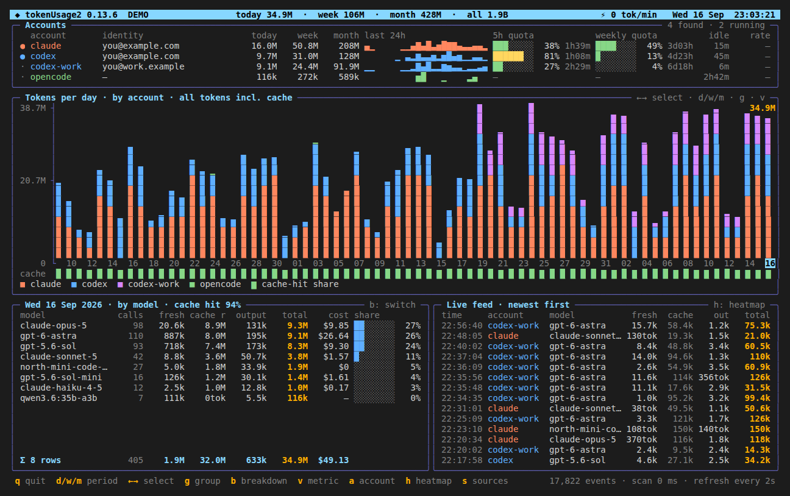

<!--
SPDX-FileCopyrightText: 2026 Marcel Petrick

SPDX-License-Identifier: GPL-3.0-or-later
-->

# tokenUsage2

[](https://github.com/marcelpetrick/tokenUsage2/actions/workflows/tokenUsage2.yml)
[](https://github.com/marcelpetrick/tokenUsage2/releases/latest)
[](https://github.com/marcelpetrick/tokenUsage2/actions/workflows/release.yml)
[](https://www.python.org/)
[](pyproject.toml)
[](localPipeline.sh)
[](https://github.com/astral-sh/ruff)
[](#requirements)
[](LICENSE)

A live, btop-style terminal dashboard for the tokens your coding agents burn —
**Claude Code, Codex CLI and OpenCode**, across **every local account and
backend**, as daily, weekly and monthly views. Read-only, offline, no API keys.

**Author: Marcel Petrick <mail@marcelpetrick.it>**

**Note: this project is generated with AI.**

**License: GPLv3 or later. See [`LICENSE`](LICENSE).**

**History:** started in [codingWithGPT](https://github.com/marcelpetrick/codingWithGPT)
and moved here with its full history (see `CHANGELOG.md` 0.3.8); all work
continues in this repository.



*Live on a real workstation: Claude Code, two Codex accounts and OpenCode, one
account label blacked out. For a synthetic frame, run `--demo` or
[`scripts/screenshot.py`](scripts/screenshot.py).*

## Quick start

```bash
cd tokenUsage2
python3.14 -m venv .venv && .venv/bin/pip install -e .
.venv/bin/tokenusage2            # live dashboard
.venv/bin/tokenusage2 --doctor   # what was found, and does it add up?
```

Without installing anything: `PYTHONPATH=src python3.14 -m tokenusage2`.

The first start indexes every transcript once (about 2 s for 1.5 GB of logs)
into a local archive; every later start and refresh only reads what was
appended, so a restart takes about 0.2 s.

## What it shows

| Panel | Content |
|-------|---------|
| **Header** | Clock, live burn rate (tokens/min over the last 5 min), today / week / month / all-time totals. |
| **Accounts** | One row per discovered account: tool, label, e-mail, plan, today/week/month/all, a 24 h sparkline, idle time, and **live 5 h and weekly quota bars** with reset countdowns. `●` marks accounts with a running agent process. |
| **Timeline** | Stacked bars for the last N days, ISO weeks or months — coloured by account, tool, backend, model or project. The cursor selects a bar and scrolls back through the whole history. Retained history whose split is unknown is drawn hatched (`▒`); a row below the dates shows each bucket's cache-hit share. |
| **Breakdown** | The selected bar by model (with backend), project, session (with its first and last request), backend, account or tool: calls, fresh input, cache read, cache write, output, total, share, cache-hit rate. |
| **Live feed** | The newest requests as they land — model, project and token split; rows younger than 20 s are highlighted. |
| **Heatmap** | Hour-of-day × weekday activity over the last four weeks (replaces the feed on `h`). |
| **Sources** | Discovered homes and *how* each was found, file/event counts, archive path, quota freshness, backend hints, and a reconciliation against each tool's own totals (`s`, or `--doctor`). |

Four metrics are available: all tokens including cache (the raw total), fresh
input + output, output only, and the API-equivalent cost.

**Alerts** appear in the status line when a 5 h or weekly quota reaches 90 %
or the burn rate climbs far above the typical active minute of the last seven
days — optionally also as a desktop notification (`notify-send`) and a terminal
bell. Each fires once per quota window or burn episode; `--json` lists them.

## Keys

| Key | Action |
|-----|--------|
| `d` `w` `m` (or `1` `2` `3`) | daily / weekly / monthly buckets |
| `←` `→` `[` `]` | move the bucket cursor · `PgUp` `PgDn` page · `Home` oldest · `End` now |
| `g` | colour the timeline by account → tool → backend → model → project |
| `b` | breakdown by model → project → session → backend → account → tool |
| `v` | metric: total incl. cache → fresh → output → API-equivalent cost |
| `a` | filter to one account (cycles, then back to all) |
| `h` | heatmap ↔ live feed |
| `s` | sources overlay · `?` / `F1` help · `Esc` closes overlays |
| `e` | export the timeline and the breakdown as CSV (to `$XDG_DATA_HOME/tokenusage2/exports`) |
| `t` | theme: default, midnight, amber, plain |
| `x` | redact e-mail addresses |
| `r` | rescan now (re-runs discovery) · `p` pause · `+` `-` refresh interval |
| `q` | quit |

## How accounts are found — nothing is hardcoded

A home only becomes an account when its content proves it (`projects/` for
Claude Code, `sessions/` or `auth.json` for Codex, the database file for
OpenCode). Candidates come from, in priority order:

1. **The config file** — extra homes you want included.
2. **The environment** — `CLAUDE_CONFIG_DIR`, `CODEX_HOME`.
3. **Running agent processes** — the same variables read from
   `/proc/<pid>/environ` of every running `claude`/`codex`, because a shell
   function such as `codex-work() { CODEX_HOME=~/.codex-work codex; }` is gone
   once the process starts but its environment is not. Only these named
   variables are extracted; nothing else of a process environment is kept.
4. **Shell rc files** — assignments of those variables in `~/.zshrc`,
   `~/.bashrc`, `~/.profile`, fish config, … (functions, aliases, exports).
5. **Default locations** — `~/.claude`, `$XDG_CONFIG_HOME/claude`, `~/.codex`,
   `$XDG_DATA_HOME/opencode/opencode.db`.
6. **A scan of `$HOME`** for `.claude*` / `.codex*` directories (and
   `claude*` / `codex*` under `$XDG_CONFIG_HOME`).

Identities come from the tools' own files: Claude's `oauthAccount` in
`.claude.json`, and the e-mail and plan claims of Codex's `id_token` JWT in
`auth.json` (the token itself is never stored or shown).

### Backends: which service answered?

Claude Code can be pointed at Ollama or a proxy with `ANTHROPIC_BASE_URL`, and
the transcripts then still say "Claude Code". tokenUsage2 separates them:

- Anthropic's API stamps every response with a `req_…` request id; local
  Anthropic-compatible servers do not.
- Launchers that set `ANTHROPIC_BASE_URL` and a model — in rc files or in the
  environment of a running process — map each model to its host, shown as
  `ollama@192.168.1.10` or `localhost:4747`. Credentials in URLs are dropped.
- The config file can pin model globs to a label and overrides both.

Labels are resolved when the dashboard draws, not stored: the archive keeps
only what the log says, so a config change or a newly found launcher
relabels the whole history.

Codex reports its provider per session (`model_provider`), OpenCode per message.

## Where the numbers come from

| Tool | Source | Rule |
|------|--------|------|
| Claude Code | `<home>/projects/**/*.jsonl` | Every content block rewrites the same message, and streaming copies still carry `output_tokens: 0`: one request per `(message.id, requestId)` across all homes, keeping the **largest** copy — a copied home adds nothing and is flagged by `--doctor`. |
| Claude Code | `<home>/stats-cache.json` | Daily totals, used only for days *before* the first surviving transcript; the split is unknown, so they count toward the raw total only and are drawn hatched. |
| Claude Code | statusline snapshots (`<home>/*rate-limit*.json`, `$XDG_STATE_HOME/*/quota/claude.json`) | 5 h / weekly quota, newest snapshot wins. Claude Code only exposes quota to a statusline hook, e.g. the one installed by `abtop --setup`. |
| Codex CLI | `<home>/sessions/**/rollout-*.jsonl`, `archived_sessions/` | `token_count` events; rate-limit refreshes repeat the same cumulative total, so one increment per `(thread, cumulative total)`. `input_tokens` includes the cached part and is split. Matches Codex's own `threads.tokens_used` (±0–2 %). |
| Codex CLI | the same events | `rate_limits` per account — live 5 h and weekly quota for each `CODEX_HOME`. |
| OpenCode | `opencode.db`, table `message` | per assistant message, read past a watermark. |

All tools are normalised to *fresh input · cache read · cache write · output*
(reasoning is a subset of output). Every request is attributed to its own
timestamp and bucketed by local midnights, so 23- and 25-hour DST days stay
one day.

### Cost

The `cost` metric (`v`) and the breakdown's cost column estimate what the tokens
would cost at list prices — an API-equivalent figure, not an invoice. Requests
Anthropic's API answered use Anthropic's list prices per model (cache reads
0.1x input, cache writes 1.25x for the 5-minute and 2x for the 1-hour TTL,
which is why the split is recorded). Requests a local backend answered cost
nothing. Codex and OpenCode models are priced once `[prices]` in the config
names them; until then they show as `—`. Retained daily totals stay unpriced
because their split is unknown.

### The archive

Events are kept in `$XDG_DATA_HOME/tokenusage2/archive.sqlite`. Files are
tailed from their last offset; a truncated or replaced file is re-read, and
keys make every re-read idempotent. Claude Code deletes old transcripts after
its cleanup period — the archive keeps their history, and accounts whose home
disappeared are listed as archived.

## Performance

Measured with [`scripts/profile_app.py`](scripts/profile_app.py) against a real
home directory (1.5 GB of Claude Code and Codex logs, 46k requests, Python
3.14, medians). Every optimisation was driven by its cProfile output, and the
ingest changes were checked to produce an identical event fingerprint.

| Stage | 0.3.0 | now | What changed |
|-------|------:|----:|--------------|
| Cold index (first start) | 4.1 s | 1.8 s | Codex record types checked in a 256-byte line head; only the newest rate limits kept |
| Warm start (load archive) | 207 ms | 150–170 ms | plain slots dataclasses, no second sort |
| Idle rescan (every refresh) | 21 ms | 4.7 ms | incremental `/proc` scan, `os.scandir` string paths, O(1) backfill check |
| Snapshot · day / week / month | 69 / 78 / 79 ms | 20 / 25 / 26 ms | running all-time totals; buckets walked by slice |
| Render 160 × 48 | 1.9 ms | 1.7 ms | — |

## Compared with the neighbours

| | [`tokenUsage`](https://github.com/marcelpetrick/codingWithGPT/tree/master/tokenUsage) | abtop | AgentWhileTrue | **tokenUsage2** |
|-|-|-|-|-|
| Purpose | one-shot HTML/PNG reports | live per-session monitor | resume agents after quota resets | live usage evaluation |
| Data | Token Use binary + stats-cache + `threads.tokens_used` | open transcripts of running sessions | rollout quota + statusline bridge | all transcripts, own archive |
| Codex accounts | `~/.codex` only | `~/.codex` only | per process via `CODEX_HOME` | every `CODEX_HOME`, found automatically |
| Claude backends | not separated | not separated | n/a | Anthropic vs. each Ollama host / proxy |
| History | a snapshot | current sessions | none | daily / weekly / monthly, survives cleanup |
| Claude dedup | Token Use (by message) | sums every line | n/a | by message, largest copy wins |

## Command line

```text
tokenusage2 [--once | --json | --csv | --doctor] [--demo]
            [--period day|week|month] [--group account|tool|backend|model|project]
            [--breakdown …] [--metric total|fresh|output] [--account LABEL]
            [--theme default|midnight|amber|plain] [--interval SECONDS]
            [--archive PATH | --no-archive] [--config PATH] [--home DIR] [--tz ZONE]
            [--width N] [--height N] [--color auto|always|never] [--redact]
```

- `--once` prints one frame (great in scripts or `watch`), `--json` a
  machine-readable snapshot, `--csv` the timeline as CSV, `--doctor` the
  sources report.
- `--demo` uses deterministic synthetic data, for screenshots and trying it out.
- `NO_COLOR` selects the plain theme.

## Configuration (optional)

`$XDG_CONFIG_HOME/tokenusage2/config.toml` — only needed for homes that cannot
be discovered, or to rename and pin things:

```toml
[discovery]
claude_homes = ["~/clients/acme/.claude"]
codex_homes = []
opencode_dbs = []
ignore = ["~/.codex-old"]
scan_home = true              # look for ~/.claude* and ~/.codex*
# rc_files = ["~/.zshrc"]     # override the default rc file list

[labels]
"~/.codex-work" = "codex · company"

[backends]
"qwen3*" = "ollama@gpu-box"   # model glob → backend label

[prices."gpt-*"]              # USD per 1M tokens — example values, use your price list
input = 1.0
output = 8.0
cache_read = 0.1              # optional: cache_read, cache_write, cache_write_1h

[alerts]
quota_percent = 90           # a 5 h or weekly quota at or above this
burn_factor = 5              # a burn rate above 5x the typical active minute …
burn_floor = 250000          # … and above this many tokens per minute
notify = true                # desktop notification through notify-send
bell = false                 # terminal bell
```

## Privacy

- Read-only: it never writes into any tool's directory and makes no network
  requests.
- Only usage metadata is extracted — timestamps, model, backend, working
  directory, session id and token counts. Prompt and response text is never
  stored; OAuth tokens and API keys are never read out.
- `--redact` / `x` masks e-mail addresses on screen and in JSON.

## Development

```bash
python3.14 -m venv .venv && .venv/bin/pip install -e '.[dev]'
./localPipeline.sh          # ruff lint + format check, pytest with a 90 % branch-coverage
                            # gate, demo smoke run, sdist/wheel build, then launch
./localPipeline.sh --noRun  # the same without the final launch (what CI runs)
./localPipeline.sh --fix    # apply ruff fixes first
.venv/bin/python scripts/profile_app.py   # time and cProfile every stage on your real data
```

CI ([`.github/workflows/tokenUsage2.yml`](.github/workflows/tokenUsage2.yml))
runs `./localPipeline.sh --noRun` on Python 3.14 for every push and pull
request, publishes a demo frame in the job summary and uploads coverage and the
built distributions. Every push to `master` whose version has no tag yet also
becomes a [GitHub release](https://github.com/marcelpetrick/tokenUsage2/releases)
with sdist, wheel and that version's changelog section as the notes
([`release.yml`](.github/workflows/release.yml)). Architecture and the design rationale are in
[`PLAN.md`](PLAN.md).

## Requirements

Linux (process discovery reads `/proc`; the dashboard uses `termios`), Python
3.14+, a terminal of at least 70 × 16 cells — 120 columns and more shows the
breakdown and the live feed side by side. No third-party runtime packages.
